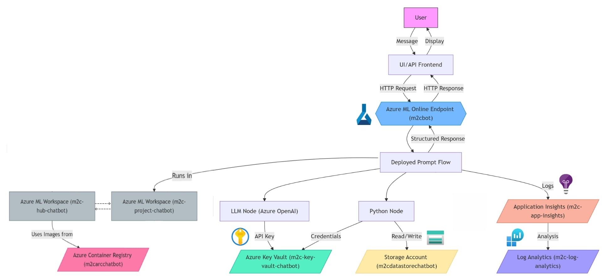
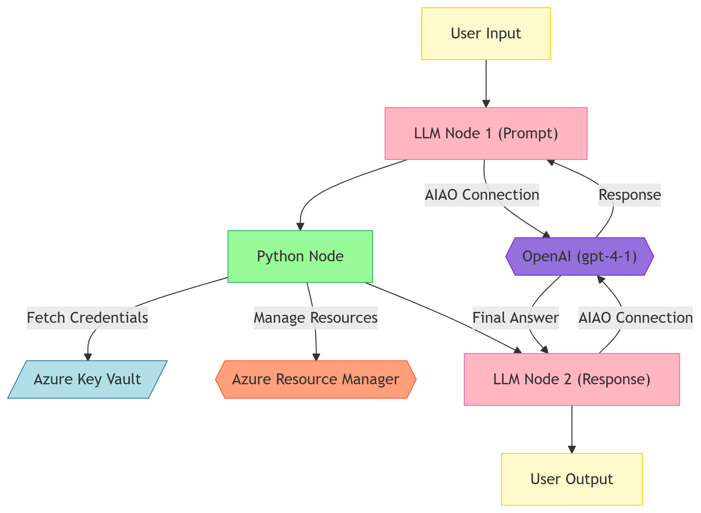
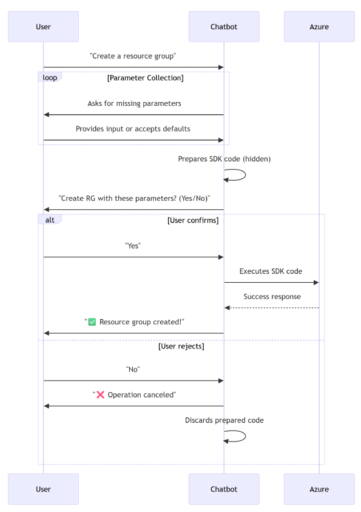
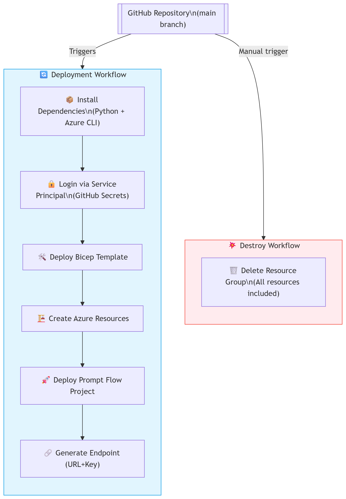

# 🤖 Azure Agentic AI Bot with Full Infrastructure Automation

This repository contains the full implementation of my end-of-studies project as a **DevOps Engineer intern at Move2Cloud**. It showcases an **agentic AI bot built on Azure**, capable of performing real-time actions (create, update, delete, list) on a user's Azure environment — combining the power of **Prompt Engineering**, **Azure AI Foundry**, and **infrastructure-as-code (IaC)** using **Bicep**.

---

## 📌 Project Overview

### 🎯 Goal  
Build a cloud-native, secure, and intelligent assistant that helps users manage their Azure resources through natural language — all fully deployed and automated via CI/CD pipelines.

---

## 🧠 Key Technologies

- **Azure AI Foundry** (formerly Azure AI Studio)
- **Azure OpenAI** (GPT-4o)
- **Azure Prompt Flow** (Agentic LLM architecture)
- **Bicep** (Infrastructure-as-Code)
- **GitHub Actions** (CI/CD pipelines)
- **Azure VM** for hosting the deployed Prompt Flow
- **Role-based access control**, **Key Vault**, **Container Registry**, **NSP**, and more
- **Azure Monitoring & Application Insights**
- **Azure Cost Management**
- **Security Best Practices** (identity, secrets, access policies)

---

## 🏗️ Architecture

### 📦 Infrastructure (via Bicep)

All resources are declared in the [`/bicep`](./bicep) folder and deployed through GitHub Actions.  
The main modules include:

- `aiServices.bicep`
- `applicationInsights.bicep`
- `containerRegistry.bicep`
- `hub.bicep`
- `keyVault.bicep`
- `logAnalytics.bicep`
- `networkSecurityPerimeter.bicep`
- `project.bicep`
- `storageAccount.bicep`

These modules ensure **secure, repeatable deployments** of all Azure services used in the bot's lifecycle.

📎 *See*: `deploy.yml` and `destroy.yml` in [`.github/workflows`](./.github/workflows)  

---

### 🤖 Prompt Flow (Agentic AI Bot)

The [`/promptflow`](./promptflow) folder defines the **conversational agent logic** using Azure Prompt Flow.  
The flow is deployed to an Azure VM and exposed via a secure endpoint — consumed by a custom interface for users to interact with.

#### 🔍 Main features:

- Classifies user intent (list, create, delete, update)
- Generates SDK-based code via Prompt Engineering
- Confirms and executes operations securely
- Uses OpenAI GPT-4o for generation
- Built using modular prompt nodes and Python nodes
 

---

## 💡 Example Use Case

> **User input:**  
> _"Create a resource group in West Europe named `rg-demo`."_

1. The bot detects the intent as **"create"**
2. It generates Azure SDK code to create the resource
3. It asks for user confirmation before execution
4. If confirmed, the action is performed securely and logged

---

## ⚙️ CI/CD Pipelines

- **`deploy.yml`**: Automates deployment of both Bicep infrastructure and Prompt Flow components  
- **`destroy.yml`**: Safely tears down all resources, respecting role assignments and security configurations

CI/CD workflows ensure:

- 🔐 Secure, reproducible deployments  
- ⚙️ Parameterized environment setup  
- 🔁 Integration with GitHub Actions for versioned updates

---

## 🚀 Why This Project Matters

- 🎯 Demonstrates how **agentic AI bots** can safely manage cloud infrastructure
- ⚡ Combines **DevOps**, **Cloud Automation**, and **LLM Ops**
- 🛠️ Leverages **Azure AI Foundry** to build real-world, production-grade flows
- 🔒 Emphasizes **secure deployments** and **role-based access**
- 🧠 Includes **monitoring** and **cost visibility** using native Azure tools
- 🔁 Fully automated lifecycle from code to cloud using **Bicep** and **CI/CD**

---

## 🔍 Looking Ahead

I'm passionate about building intelligent agents, automating DevOps workflows, and scaling AI-powered cloud tools.  
I'm actively seeking full-time opportunities in:

- **DevOps / Platform Engineering**
- **Cloud Automation (Azure, AWS)**
- **AI Agent Development / Prompt Engineering**

---

📫 [LinkedIn](https://www.linkedin.com/in/mariam-ghamgui) | 🌐 [Portfolio](https://mariam-ghamgui.github.io)

---

